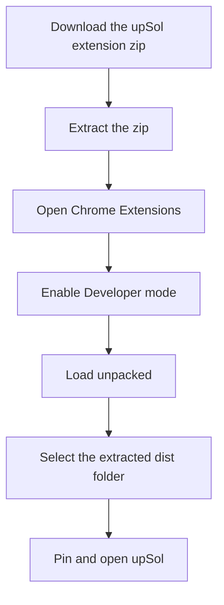
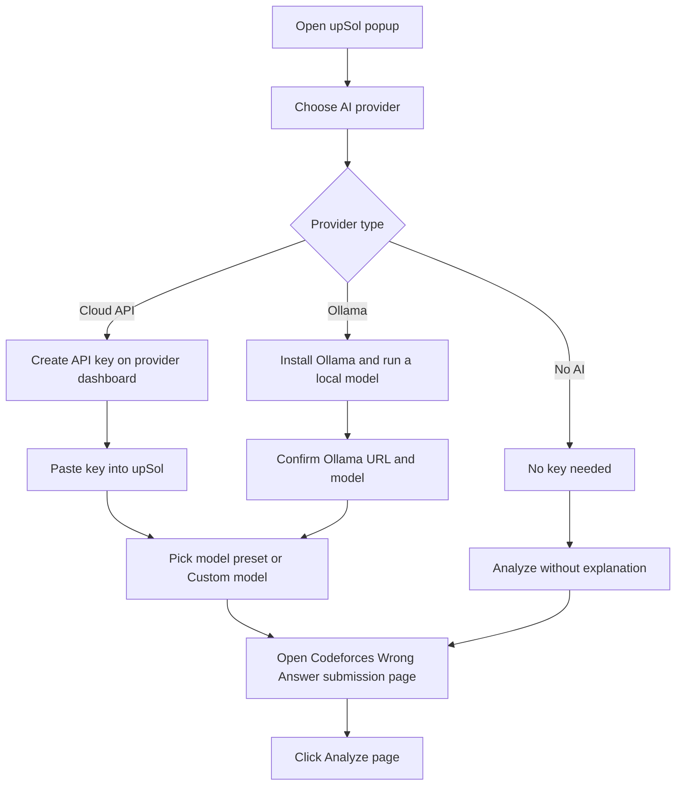
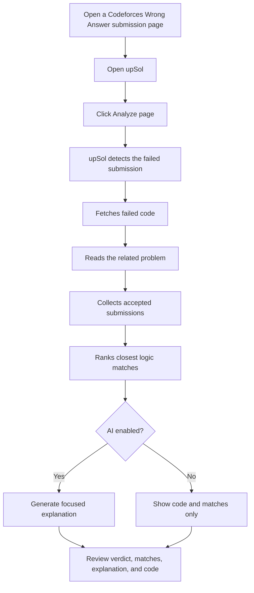

<<<<<<< HEAD
# upSol

upSol is a Chrome extension for debugging Codeforces wrong-answer submissions. Start from a Codeforces Wrong Answer submission page, click **Analyze page**, and upSol compares the failed code with nearby accepted submissions, then shows the failed code, closest accepted logic matches, and an optional AI explanation.

## What It Does

- Reads the current Codeforces Wrong Answer submission page.
- Fetches the failed source code and accepted candidate submissions.
- Compares solutions by logic, token overlap, and coding style.
- Shows the closest accepted matches with scores and accepted code.
- Generates an explanation when an AI provider is configured.
- Supports No AI mode for code fetching and match ranking only.

## Supported AI Providers

| Provider | Default model | Notes |
| --- | --- | --- |
| Gemini | `gemini-2.5-flash-lite` | Uses Google AI Studio API key |
| OpenAI | `gpt-4o-mini` | Uses Chat Completions |
| Claude | `claude-3-5-haiku-latest` | Uses Anthropic Messages API |
| DeepSeek | `deepseek-v4-flash` | OpenAI-compatible API |
| Kimi | `kimi-k2.6` | Moonshot/Kimi OpenAI-compatible API |
| Ollama | `qwen2.5-coder:7b` | Local model at `localhost:11434` |
| No AI mode | None | Fetches code and ranks matches only |

The model field includes presets, but users can choose **Custom model** and enter any provider-supported model id.

## Setup Flow



## Install The Extension

Users need to clone or download this repository and load the included `dist` folder in Chrome.

Get the repository:

```powershell
git clone https://github.com/meoww-07/fix.git
```

Or download it from GitHub:

1. Open https://github.com/meoww-07/fix
2. Click **Code**.
3. Click **Download ZIP**.
4. Extract the ZIP file.

Then load it in Chrome:

1. Copy this URL and paste it into Chrome:

   ```text
   chrome://extensions
   ```

2. Press **Enter** to open the Chrome Extensions page.
3. Turn on **Developer mode** from the top-right corner.
4. Click **Load unpacked**.
5. In the folder picker, open the cloned or extracted repository folder.
6. Select the `dist` folder. This is the extension folder that contains `manifest.json`.
7. Click **Select Folder**.
8. Chrome should now show **upSol** in the extensions list.
9. Click the puzzle-piece extensions icon in the Chrome toolbar.
10. Pin **upSol** so it stays visible.

To update upSol later:

1. Download the new release zip.
2. Extract it.
3. Open `chrome://extensions`.
4. Remove the old upSol extension or click **Reload** after replacing the folder.
5. Load the new `dist` folder if needed.

## AI Provider Setup

Open upSol, go to **AI Settings**, choose a provider, then paste the API key for that provider.



Provider links:

- Gemini: https://aistudio.google.com/app/apikey
- OpenAI: https://platform.openai.com/api-keys
- Claude: https://platform.claude.com/
- DeepSeek: https://platform.deepseek.com/api_keys
- Kimi: https://platform.kimi.ai/
- Ollama for Windows: https://ollama.com/download/windows

Keep API keys private. Do not commit keys, paste them in issues, or share screenshots that show them.

## How To Use



Recommended workflow:

1. Open the Codeforces Wrong Answer submission page for the failed solution.
2. Open upSol from the Chrome toolbar.
3. Select an AI provider or **No AI mode**.
4. Click **Analyze page**.
5. Read the failed submission summary.
6. Compare your code against the closest accepted matches.
7. Use the explanation only when AI is enabled.

If Codeforces blocks source scraping, open 1-3 accepted submission source pages in tabs first. upSol can use those opened pages as candidates.

## Project Structure

```text
src/
  App.tsx                    Popup UI
  background/serviceWorker.ts Extension orchestration and Codeforces workflow
  content/contentScript.ts    Codeforces page extraction
  lib/ai.ts                   AI provider calls
  lib/codeforces.ts           Codeforces parsing helpers
  lib/fingerprint.ts          Logic/style fingerprinting
  lib/promptBuilder.ts        AI explanation prompt
public/
  manifest.json               Chrome extension manifest
dist/                         Built extension output
```

## Notes

- upSol works best from a Codeforces Wrong Answer submission page.
- In No AI mode, upSol does not invent explanations. It only fetches code and ranks matches.
- API-based providers may require billing or account credits.
- Ollama quality depends on the local model and your device resources.
=======
# fix
a CF chrome extension that finds solution snippets closest to ur WA
>>>>>>> origin/main
